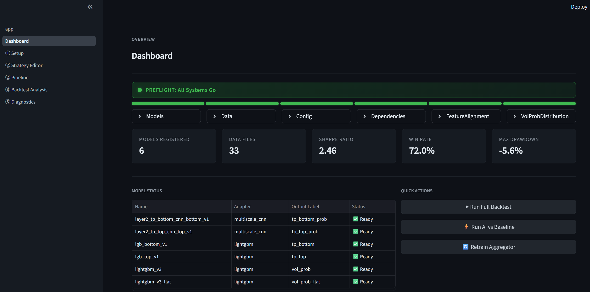

# ApexQuant

A research platform for building and backtesting quantitative trading strategies with pluggable AI models.

 

## Disclaimer

ApexQuant is a research platform released for academic and educational use only. Nothing in this repository — including the bundled models, backtest results, equity curves, Sharpe ratios, or any other performance metric — constitutes investment, financial, legal, or tax advice, nor a recommendation to buy, sell, or hold any security. Backtested results are derived from historical data and are subject to look-ahead bias, survivorship bias, transaction-cost assumptions, and modelling error; **past performance is not indicative of future results**. The software is provided "as is" without warranty of any kind (see [`LICENSE`](LICENSE)). The author and contributors accept no liability for any loss or damage arising from use of this code or its outputs in live trading. Use at your own risk; consult a licensed financial professional before making investment decisions.

## What is ApexQuant

Most quant-research pipelines are tangled one-offs: a notebook that trains a model, another notebook that backtests it, a third that produces charts, and every change to the data layer cascades through all three. ApexQuant separates those concerns. Train models wherever you like (Colab, a GPU box, a laptop) and save each one as a `weights` file plus a small `meta.json`. The platform auto-discovers the folder, picks the right adapter, runs inference, backtests a strategy against the signals, and produces reports.

The architecture is folder-based auto-discovery, not a rigid registry. Drop `models/my_model/{weights.joblib, meta.json}` and it appears in the UI as Ready. Strategies consume signals by name (`tp_top`, `vol_prob`) rather than importing predictor modules, so swapping a model doesn't require touching strategy code.

ApexQuant was built while validating a three-layer cascaded decomposition framework that reaches +67.2% total return / Sharpe 2.14 on the bundled research dataset (NASDAQ ITCH 2020–2022, 8 tickers). The framework is one concrete use case; the platform itself is general — any signal architecture that fits the `Predictor` interface plugs in.

## Screenshot




## Quickstart

A step-by-step tutorial from a fresh clone to reading your first backtest report. Assumes Python is installed and you can use a terminal; no prior knowledge of this project is required.

### Prerequisites

- Python 3.10 or newer — check with `python --version`
- git
- About 4 GB of free disk space for the repo plus bundled sample data and checkpoints
- Optional: a CUDA GPU for faster CNN inference — not required; the bundled demo runs on CPU in roughly 30 seconds

### Step 1 — Clone the repo

```bash
git clone https://github.com/Heeeeeeliang/apexquant.git
cd apexquant
```

### Step 2 — Set up the environment

Two options; pick whichever you're comfortable with.

**Option A — pip (simpler, works everywhere):**

```bash
python -m venv venv
source venv/bin/activate       # macOS/Linux
venv\Scripts\activate          # Windows
pip install -e .
```

**Option B — conda:**

```bash
conda env create -f environment.yml
conda activate apexquant
```

Installation takes about 2–5 minutes depending on network speed.

### Step 3 — Launch the app

```bash
python run_all.py --frontend
```

Streamlit prints a local URL, usually `http://localhost:8501`, and the browser opens automatically. If it doesn't, copy the URL into your browser manually.

You should land on the **Dashboard** page, which runs all six preflight checks automatically on load (Models, Data, Config, Dependencies, FeatureAlignment, VolProbDistribution). If any check is red, the check name tells you what's missing — see the Troubleshooting section below.

### Step 4 — Run your first backtest

Follow this click-path in the UI:

1. In the left sidebar, click **Setup**.
2. Expand the **Presets** panel near the top.
3. Pick `run9_trailstop` from the preset picker — the config updates immediately (no separate Apply button).
4. In the sidebar, click **Dashboard** to confirm the preflight health bar is still green.
5. In the sidebar, click **Backtest Analysis**.
6. Click **▶ Run AI Backtest**. Expected runtime: roughly 30 seconds on CPU, 15 seconds on GPU.

### Step 5 — Read the results

When the backtest finishes, the page fills out six tabs: **Overview**, **Per Ticker**, **Trade Log**, **Verdict & Attribution**, **Trade Markers**, **Diagnostics**.

- **Overview** shows the headline numbers. Expected values on the bundled sample: roughly +2.2% total return, Sharpe 1.31, max drawdown −1.53%, 84 trades, win rate 52.4%. These are smaller-scale than the full-dataset numbers (+67.2% / Sharpe 2.14) because the demo uses only 6 months of AAPL + SPY.
- **Verdict & Attribution** shows the GREEN/YELLOW/RED verdict card plus a per-layer attribution breakdown (which layer contributed to each trade: volatility gate → turning point → direction).
- **Diagnostics** runs post-backtest scans — trade quality, equity shape, feature drift — and links to the standalone Diagnostics page for deeper views.

### Step 6 (optional) — Try a different preset

Two other presets ship with the repo: `run1_baseline` (no trail stop) and `run8_tranche_exit` (tranche-based exit). Same click-path — just pick a different preset at Step 4.3.

### Troubleshooting

- **Preflight shows "Models not found".** The bundled sample checkpoints live in `examples/sample_checkpoints/`. If the registry didn't pick them up, point the Setup page's `models_dir` to that path, or copy the folder's contents into `models/`.
- **`run_all.py` exits immediately.** Check your Python version — the entry script requires 3.10 or newer.
- **Port 8501 is already in use.** Launch Streamlit directly on a different port: `streamlit run frontend/app.py --server.port 8502`.

## How ApexQuant works

**Step 1 — Connect your data.** Drop OHLCV CSVs into `data/` or point the loader at a Google Drive folder. Standard columns (`Open, High, Low, Close, Volume`, plus a `DatetimeIndex`) are auto-detected. Custom sources plug in via `data/loader.py`.

**Step 2 — Add your models.** Train in any environment. Save the weights plus a `meta.json` describing the adapter type and output signal name:

```json
{
  "adapter": "lightgbm",
  "output": "probability",
  "output_label": "tp_bottom",
  "task": "bottom",
  "direction": "long"
}
```

Sync the folder into `models/` and the registry picks it up on next launch — the model appears in the Dashboard as Ready.

**Step 3 — Write a strategy, run a backtest.** In the Strategy Editor, consume model signals by name (not by position) — e.g. `signals["tp_bottom"].prob > 0.5`. Click Run. The Backtest Analysis page returns Sharpe, win rate, max drawdown, an equity curve, and a per-layer attribution breakdown.

## Feature overview

- Folder-based model registry with auto-discovery
- Adapters for LightGBM and PyTorch CNN/LSTM; extensible via the `Predictor` base class
- Streamlit UI with Dashboard health checks, config presets, Backtest Analysis with verdict cards, and diagnostic scans
- Backtrader-based execution engine with custom fill control
- Strategy Editor for custom logic, plus a `strategies/user/` folder for saved strategies
- Preset library with reproducible runs (`run1_baseline`, `run8_tranche_exit`, `run9_trailstop`)
- Over 150 tests (unit + end-to-end) and a repo-level security audit

## Roadmap

**Near-term**
- Live trading integration (Interactive Brokers, Alpaca, selected CN brokers)
- Additional asset classes (crypto, futures, FX)

**Longer-term**
- New model adapters: BERT for news sentiment, Temporal Fusion Transformer, LLM-based signal generation
- Improved backtesting engine: better slippage modelling, market-impact simulation
- Risk management module: position sizing, drawdown control, correlation-aware portfolio construction

## How to extend

**Adding a model.** Subclass `Predictor` in [`predictors/base.py`](predictors/base.py), implement `predict(bar, context) -> PredictionResult`, register via `REGISTRY.register(instance)` at import time, and drop a matching `meta.json`. Existing adapters in `predictors/adapters/` (`vol_adapter.py`, `cnn_adapter.py`, `meta_adapter.py`) show the pattern for wrapping LightGBM and PyTorch checkpoints.

**Adding a data source.** Extend [`data/loader.py`](data/loader.py). The contract: given a ticker and a frequency, return a `pandas.DataFrame` with a `DatetimeIndex` and OHLCV columns. The bundled CSV backend is the reference implementation.

**Writing a custom strategy.** Subclass `BaseStrategy` in [`strategies/base.py`](strategies/base.py) and consume `AggregatedSignal` — strategies never import from `predictors/`. Drop a `.py` into `strategies/user/` or author in-UI via the Strategy Editor at `frontend/pages/3_②_Strategy_Editor.py`.

## Companion repository

The research findings, ablation studies, and training notebooks that produced the bundled demo weights live in a companion repository:

https://github.com/Heeeeeeliang/Applying-Deep-Time-Series-Learning-to-Stock-Forecasting-and-Quant-Trading

## Verifying the repository

The Quickstart above runs the bundled demo. The full test
suite is for reviewers and contributors verifying repo
integrity end to end:

```bash
# Additional test-runner dependencies (not in the demo path)
pip install pytest tabulate

# Some preflight tests assert on real model checkpoints.
# Stage the bundled samples into the runtime location:
cp -r examples/sample_checkpoints/* models/

# Run
PYTHONPATH=. pytest tests/ -v
```

Expected on a fresh clone: `157 passed, 5 skipped, 2 xfailed`.

## Acknowledgement of Generative AI Use

This project was developed with assistance from generative AI
tools. Claude Code (Anthropic) was used to assist with
implementation tasks: generating boilerplate, writing tests,
diagnosing bugs, and producing repository reproducibility
audits. Claude (Anthropic, web/desktop) was used as a
discussion partner for architectural decisions and for prompt
engineering. All generated code was reviewed, tested, and
integrated by the author. The research design, the three-layer
cascaded framework, the empirical findings, the model
architectures, and all results are the author's original work.
See the accompanying dissertation Acknowledgements for full
disclosure.

## License

This repository is licensed under the **GNU General Public License v3.0** (GPLv3). See [`LICENSE`](LICENSE).

ApexQuant imports [Backtrader](https://github.com/mementum/backtrader) (GPLv3+) at runtime as a backtest engine component. Per GPLv3 §5, the combined work must be distributed under GPL-compatible terms; this repository therefore adopts GPLv3 to maintain license consistency across the codebase and its dependencies.

Bar-aggregated OHLCV market data redistributed alongside this codebase is governed by Databento's historical-data policy. See the [data card](https://github.com/Heeeeeeliang/Applying-Deep-Time-Series-Learning-to-Stock-Forecasting-and-Quant-Trading/blob/main/data/README.md) and [NOTICE](https://github.com/Heeeeeeliang/Applying-Deep-Time-Series-Learning-to-Stock-Forecasting-and-Quant-Trading/blob/main/NOTICE) in the research repository for full attribution — a separate licensing arrangement from the code license above.

## Citation

```bibtex
@software{apexquant2026,
  author  = {Li, Heliang},
  title   = {ApexQuant: A Research Platform for Quantitative Trading with Pluggable AI Models},
  year    = {2026},
  url     = {https://github.com/Heeeeeeliang/apexquant}
}
```

A machine-readable form is available as [CITATION.cff in the research repository](https://github.com/Heeeeeeliang/Applying-Deep-Time-Series-Learning-to-Stock-Forecasting-and-Quant-Trading/blob/main/CITATION.cff).

## Acknowledgements

Built on Streamlit, Backtrader, LightGBM, PyTorch, and pandas-ta.
